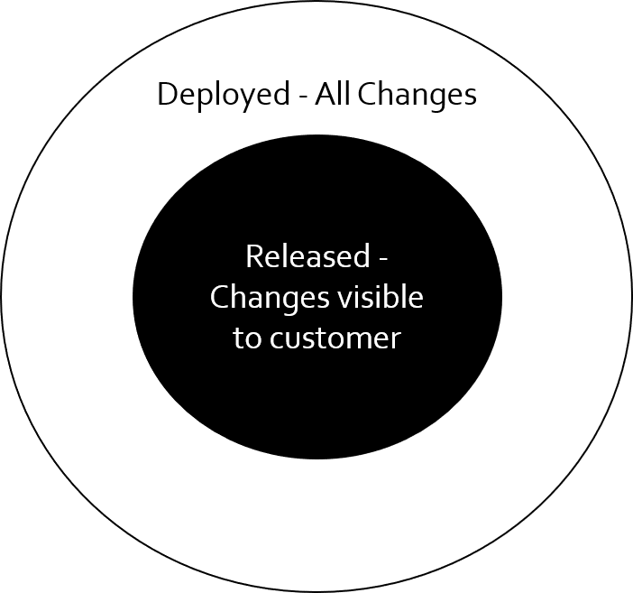
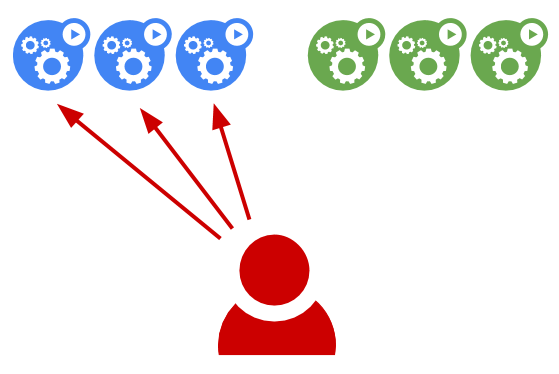
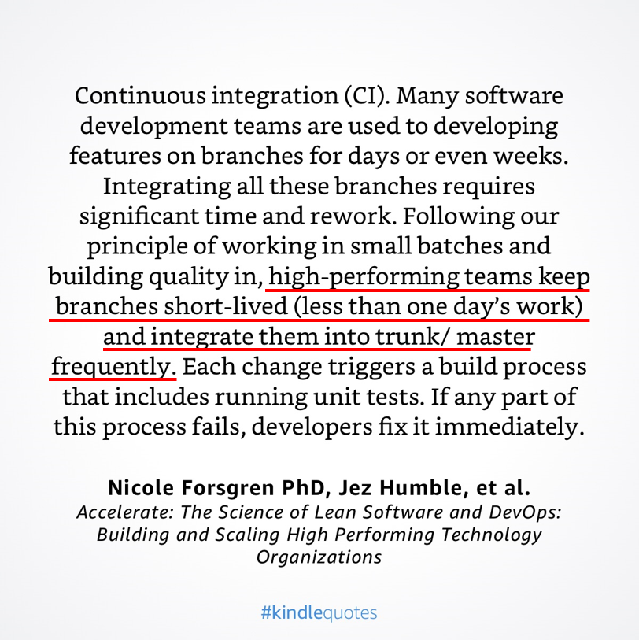

# Feature flags: the toggle, the A/B test and the canary

### The beauty of a feature flag is simplicity - it's a conditional block of code that chooses between different execution paths at runtime.

In this talk, we will combine this simple concept with DevOps principles to perform powerful operations like separating code deployments from feature releases, canary releases, product owner-driven releases, testing in production, beta & A/B testing and even, kill switches. The demos and code samples will use open source libraries like .NET Core FeatureManagement (C#) and SaaS products like Launch Darkly and Azure App Configuration. Learn how to achieve control and mastery over your deployments and releases with feature flags.

---

1. [What are Feature Flags?](#what)
2. [Differences between deployment and release](#deployrelease)
3. [Feature Flag Frameworks and Services](#frameworks)
4. [Feature Flag Use Cases](#usecases)
5. [Lifecycle & technological considerations](#lifecycle)

---

### 1. <a id="what"></a>What are Feature Flags? 
>Feature Toggles (often also referred to as Feature Flags) are a powerful technique, allowing teams to modify system behavior without changing code.
-[Martin Fowler](https://martinfowler.com/articles/feature-toggles.html)


In software, a flag is "one or more bits used to store binary values" aka a Boolean that can either be true or false. In the same context in software, a feature is a chunk of functionality that delivers some kind of value.

Thus, a feature flag, in the simplest terms, is an if statement surrounding some chunk of functionality in your software. Feature flags, in reality, can be and are more complex than that. A feature flag is a way to change your software’s functionality without changing and re-deploying your code.

Feature Flags, also referred to as "Feature Toggles" is a set of patterns which can help a team to deliver new functionality to users rapidly but safely. 

    Simple feature flag in .NET Core
The simplest version of a config flag in .NET Core involves two steps:
1. Add a config setting from appsettings.json files
```json
{
  "MyFeature": {
    "Flag1": true
  },
  "Logging": {
    "LogLevel": {
      "Default": "Information",
      "Microsoft": "Warning",
      "Microsoft.Hosting.Lifetime": "Information"
    }
  },
  "AllowedHosts": "*"
}
```

2. Read Config settings from C# code and use the flag in code flow
```csharp
public class TestModel : PageModel
{
    // requires using Microsoft.Extensions.Configuration;
    private readonly IConfiguration Configuration;

    public TestModel(IConfiguration configuration)
    {
        Configuration = configuration;
    }

    public ContentResult OnGet()
    {
        bool flag1 = bool.Parse(Configuration["MyFeature:Flag1"]);

        string featureState = "not available";
        if (flag1)
        {
            featureState = "available";
        }

        return Content($"Feature {featureState}");
    }
}
```

    Components of a Feature Flag
Consider this example code more representative of real life feature flag usage

```csharp
IFeatureFlag flag;
....
....
....
if (flag.IsTrialSubscriptionActive("user1"))
{
    Console.WriteLine($"Welcome {user1}");
}
....
....
....
if (flag.IsTrialSubscriptionActive("user1"))
{
    CheckTrialExpiryDateAndSendReminder("user1");
}
....
....
....
```
While it's not advisable to daisy chain feature flag, one flag being used in multiple location is often the norm. These are the various components of the feature flag based on the above code:
**Toggle Point:** Each check of the feature flag is a toggle point. For instance, `if (flag.IsTrialSubscriptionActive("user1"))`. There may be multiple toggle points.
**Toggle Router:** The `IFeatureFlag.IsTrialSubscriptionActive(string)` method represents a toggle router.
**Toggle Context:** This is the set of conditions that the router takes into account while computing if the user is in a Trial Period, for instance, account creation date and number of trial days.
**Toggle Configuration:** Contains informations about enable/disable toggle points. Usually, toggle configurations, are environment-specific.

---

### 2. <a id="deployrelease"></a> Difference between deployment and release
Software teams often use "deployment", and "release" loosely, even interchangeably leading to a lot of confusion. Throw in the term "ship" often used by business facing entities and that complicates the situation even further.



    Deployment
When we use the term "Deployment" we're talking about your team’s process for installing the new version of your service’s code on production infrastructure. When we say a new version of software is deployed, we mean it is running somewhere in your production infrastructure. Deployment does not mean customers have access to this new version. Deployments are low risk because even if code does not work. Deployments should have minimal impact on the customer. The decision to deploy new code should belong to the software team.

    Release
When we say a new feature is released, this means that production traffic if hitting the code for this new feature. Releasing is the process of pointing production workflow to point to the code related to the new feature. When production traffic hits this new code, all the risks associated with releases – outages, crashes,performance issues, bugs - are exposed to customers. The decision to release new features could involve various stakeholders including non-software team members.

Depending on your team’s practices, this could be considered a rollout of changes. Released changes may need to be rolled back or rolled forward ie fixed ASAP.



    Blue-green deployments
While this talk does not cover, blue-green deployments this is an useful concept to discuss anyway since it involves separating deployments from releases.

Blue-green deployments can be used instead of or with Feature Flags. Green (new) version is deployed to fresh set of machines or containers but since it's not yet exposed to production it's considered "Not released". Blue (current) version is running on currently dedicated prod infrastructure

Release in a blue-green setup usually involves making changes at the load balancer to redirect production traffic from the blue (current) machines to the green (new) machines. The operation equates to add hosts running the new version and remove hosts running the known-good version.

Blue-green deployment involve infrastructure level changes. Once switched over new changes have same high risk profile. These deployments are easy to rollback. 

>**Note:** Since blue-green deployments often involve production infrastructure, this might be an useful technique to use when infrastructure level changes occur. Feature Flags could still handle code level changes.

---

### 3. <a id="frameworks"></a>Feature Flag Frameworks and Services
    FeatureToggle
[FeatureToggle by Jason Roberts](http://jason-roberts.github.io/FeatureToggle.Docs/) is an open source library licensed under the Apache version two license. To install FeatureToggle into an application, you can simply use NuGet. The library supports multiple. NET platforms. 

Frameworks like FeatureToggle do not use magic strings to represent toggles in code and instead use strings in the configuration files to actually configure the values. Inside our code base, the library maps these configured values with strongly typed toggles. If the value of a toggle is missing from the configuration file, rather than defaulting to true or false, the application will throw an exception. This way, the application won't continue to run in an unknown state.

The FeatureToggle library aims to have a flexible provider model. Some of the types include:

- AlwaysOffFeatureToggle
- AlwaysOnFeatureToggle
- EnabledOnOrAfterDateFeatureToggle
- EnabledOnOrBeforeDateFeatureToggle
- EnabledBetweenDatesFeatureToggle
- SimpleFeatureToggle
- RandomFeatureToggle
- EnabledOnDaysOfWeekFeatureToggle
- SqlFeatureToggle

The library aims to make this provider swappable so you can swap a existing provider for a custom provider. 

The FeatureToggle library supports a number of different configuration options:
- Code (needs redeploy of code)
- App or web config (edit file)
- Centralized (SQL or RavenDB) - .NET Framework only

[Usage](http://jason-roberts.github.io/FeatureToggle.Docs/pages/usage.html)

    FeatureManagement

The [.NET Core Feature Management libraries]() provide comprehensive feature flag support. These libraries are built on top of the .NET Core configuration system.
Some of the benefits of using this library:
- Built on IConfiguration
- Supports JSON file feature flag setup
- Configuration values can change in real-time, feature flags can be consistent across the entire request
- Toggle on/off features through declarative configuration file
- Dynamically evaluate state of feature based on call to server
- API extensions for ASP.NET Core and MVC framework: Routing, Filters and Action Attributes

Feature Flags consists of a name and a feature filter. Feature Filters are scenarios for enabling/disabling flags. For instance, a filter that enables the flag for only 10% of the requests.

    FeatureManagement with Azure App Configuration

[Azure App Configuration](https://docs.microsoft.com/en-us/azure/azure-app-configuration/overview) provides a PaaS to centrally manage application settings and feature flags. You can create an end-to-end implementation of feature management in an ASP.NET Core application using Azure App Configuration using the App Configuration service to centrally store all your feature flags and control their states.

The .NET Core Feature Management libraries extend the framework with comprehensive feature flag support. These libraries are built on top of the .NET Core configuration system. They seamlessly integrate with App Configuration through its .NET Core configuration provider.

    LaunchDarkly

LaunchDarkly is a SaaS Feature Flag and Toggle Management system and serves over 200 billion feature flags/day.

It uses a streaming architecture to service feature flags in microseconds without making remote requests.  All flags are served locally and backed up using a globally distributed CDN provider.  They use what’s called Server-Sent Events (SSE), a protocol for one-way real-time messaging, to send messages to your servers whenever you change feature flag rules in your LaunchDarkly dashboard.  The SSE connection is handled automatically by the SDK.

It is also pretty easy to get started with, with some very nice tutorials that get you up and going in minutes. 

---

### 4. <a id="usecases"></a>Feature Flag Use Cases
[Toggles/Kill Switches](src/FeatureToggleMVC/readme.md)
[A/B Testing](src/FeatureToggleMVC/readme.md)
[Canary Releases](src/FeatureToggleMVC/readme.md)

---

### 5. <a id="lifecycle"></a>Lifecycle & technological considerations
    Feature Flags are technical debt
Feature flags is essentially new code you're adding which means they should be treated as technical debt. You need to have a review process in place to periodically review all feature flags. Older flags with deprecated or unused features should be removed ASAP. If a feature is released to all users, the feature flag is no longer needed, ie, should be removed. Permanent feature flags, for instance, ones used to handle subscription type access should be reviewed and maintained for as long as they're in use.

    Do not daisy chain Feature Flags
Combining multiple feature flags could lead to multiple features being toggled on or off simultaneously which could lead to unpredictable system behavior including increased system load, decrease in system performance and crashes. Using DevOps principle of small batches, limit the number of Feature Flags you're enabling or disabling at the same time.
[Cautionary tale from Microsoft's TFS launch in 2013](https://blogs.msdn.microsoft.com/bharry/2013/11/25/a-rough-patch/
)

    Measure everything
Let's say you turned on a new feature - how do you know it's working as expected? Is it throwing any errors? How is the system performance? Are people using the feature and if so, how many and what paths are they taking? Metrics are numerical units and collected constantly, logs are recorded events aka collected only when the event occurs. Use metrics and logs to measure how the Feature is doing once the flag is turned ON. 

    Use frameworks
As we discussed earlier, feature flags are additional code you add to your system. This means additional maintenance. The purpose of feature flags is to control exposure of features to the customers aka separating deployments from releases. Since feature flags are largely used for achieve team/process/business goals, they're not central to solving your actual business probelms. Do not spend time writing your own implementation unless absolutely necessary. Use mature frameworks that we discussed in earlier sections.

    Useful in CAB situations
A change-advisory board ("CAB") delivers support to a change-management team by advising on requested changes, assisting in the assessment and prioritization of changes. This body is generally made up of IT and Business representatives that include: a change manager, user managers and groups, technical experts and, possible third parties and customers (if required).

Since the CAB members are largely concerned with changes impacting customer, you could add code that does not hit any production paths (think: 0 code references in C#) over a period of time and continue pushing the code to deployment. When time comes for a CAB review, you can simply add a Feature Flag and send it for review. An additional advantage of this approach is that most, CAB members are concerned about rollback in case the code is not working and feature flags can handle this situation with ease.

    No long lived branches



With feature flags, the release of software to users becomes a business decision instead of a technical decision. The execution of a section of code or feature no longer needs a dedicated source code branch, but becomes an execution branch instead, controlled by the feature flag.